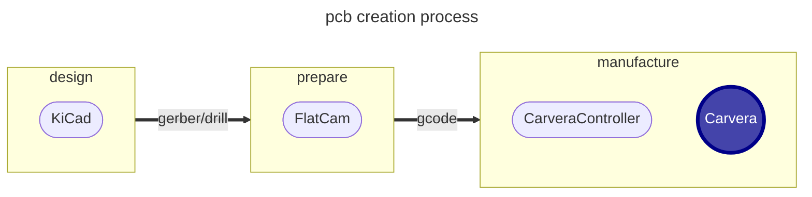

# Printed Circuit Board Creation

With the Carvera CNC machine it is possible to create PCBs at home.

## Process for creating a new PCB

Creating a new PCB is a 3 part process:

1. **Design** - where the circuit to be implemented is designed and documented in a schematic.  KiCad is the opensource tool I use to design circuit boards.  Once the circuit has been created a circuit board can be designed.  This is where the components in the schematic are organised on the circuit board and the connecting traces are routed.  This process creates gerber files and drill files which will allow the board to be created
2. **Prepare** - where the gerber files are processed and the files necessary to manufacture the circuit board are generated.  FlatCam is the opensource application I use for this stage.  As I use the Carvera CNC milling machine this stage creates a series of CNC jobs, where the approprate tool is selected and the tool paths are generated for each job.  This process generates the gcode file to be sent to the Carvera machine
3. **Manufacture** - where the gcode files are sent to the Carvera Machine.  CarveraController is used to send files to the Carvera.  This is a piece of software provided by the machine manufacturer.  There are several stages during manufacture:
    - create jig to ensure board sides are aligned if creating 2 sided boards
    - carve the traces
    - drill an insert vias to connect copper areas on different sides, if a 2-sided board
    - apply a UV cured coating to the board
    - apply the silk screen coating
    - expose the solder pads by milling off the coating to expose the underlying copper layer
    - drill holes
    - apply through-hole 'rivets' to ensure good connectivity
    - cutout board

## Software used

### KiCad

There are a number of free and paid for software options for designing circuit boards, but I chose [KiCad](https://www.kicad.org){: target=_blank}

There are many good tutorials covering KiCad, so I won't provide details on this site.

!!!Todo
    Identify what parameters need to be taken into consideration when designing to pcb for manufacture, such as:
    - via sizes
    - minimum trace width and separation (limitations of manufacture)
    - pad size

### FlatCam

Makera is creating a [CAM application](https://www.makera.com/pages/software#CarveraCAM){: target=_blank} that will eventually provide the functionality of converting Gerber files into machine gcode.  However, at the time of writing this software is still under construction, so there are 2 recommended applications.

[CopperCam](https://www.galaad.net/coppercam-eng.html){: target=_blank} and [FlatCam](http://flatcam.org){: target=_blank}.  CopperCam is windows only and requires a license to be purchased, as I use a Mac I am using FlatCam.  The install is not trivial so is covered in more detail [on this site](flatcam.md)

### CarveraController

GCode files are sent to the Carvera machine using the manufacturer provided [CarveraController](https://www.makera.com/pages/software){: target=_blank} application.  There is good documentation provided with the machine and online, so I don't need to go into the process here

!!!Todo
    Document workflow for creating:
    - single sided board (with coating on one side - no silk screen)
    - single sided board (with coating both sides and silf screen)
    - 2-sided board with coating and silk screen
