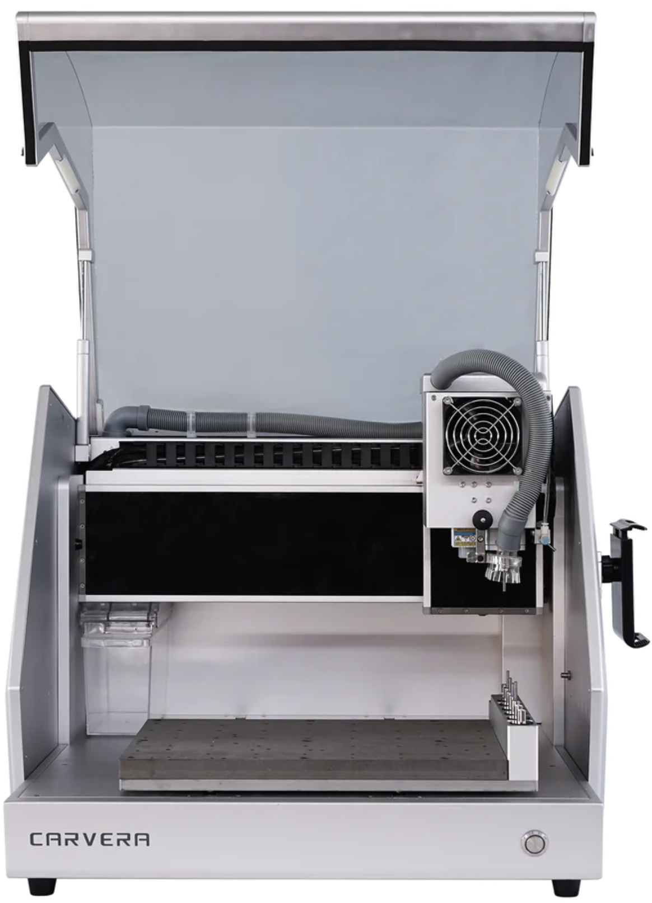
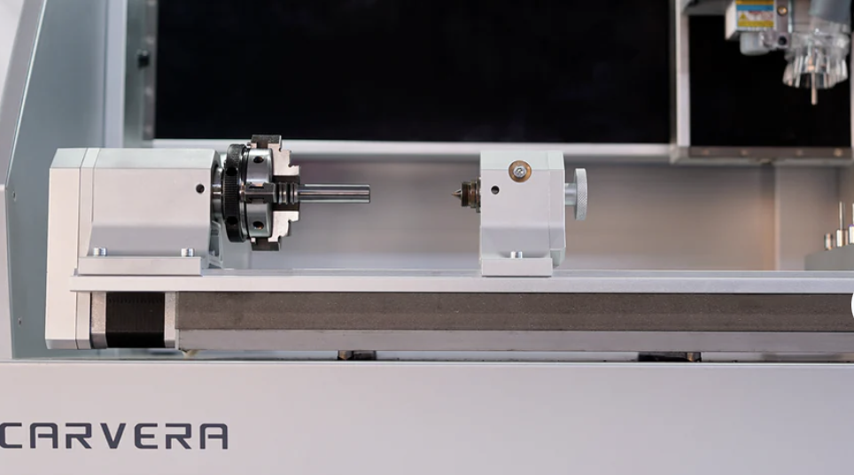
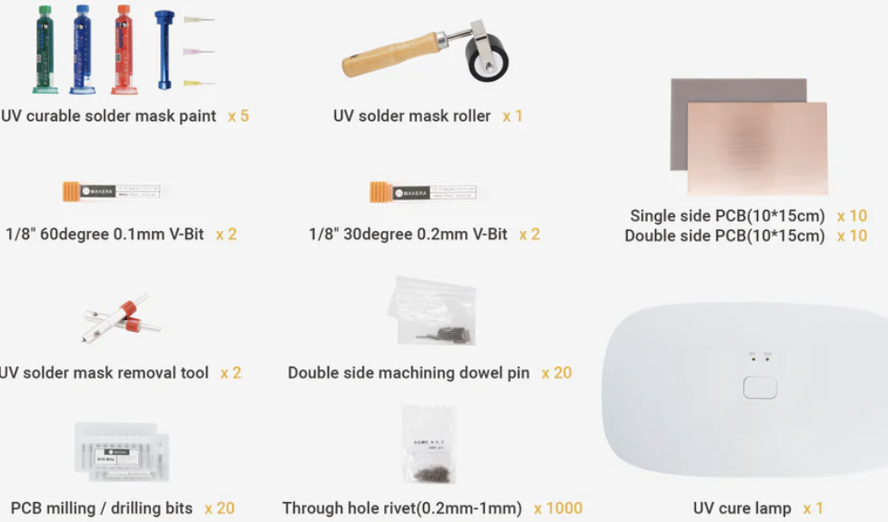

# Carvera

The [Makera Carvera CNC machine](https://www.makera.com){: target=_blank} with tool changes is a great addition to my home maker lab.  It allows me to work with many materials, to engrave, sculpt and cut.

In addition to the base machine I have the 4th axis module
{: width=80%}

and the PCB Fabrication pack
{: width=80%}

One of the key uses I make of this machine is to [create custom PCBs](../activities/pcb/index.md)

## Resources

- [Wiki](https://wiki.makera.com/en/home){: target=_blank}
- [Makera](https://www.makera.com){: target=_blank}
- [Discord](https://discord.gg/NQ5r9jGNXV){: target=_blank}
- [YouTube](https://www.youtube.com/c/makera){: target=_blank}